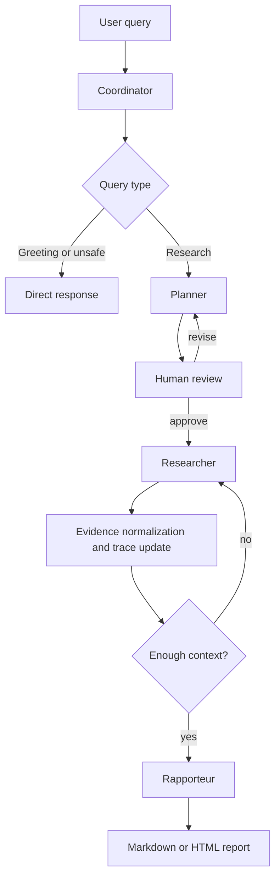

# Architecture

SDYJ Multi Agents is organized as a stateful research workflow. The design goal
is to keep the agent behavior controllable: each role owns a narrow
responsibility, every step updates a shared state, and the user can approve the
plan before tools are executed.

## Workflow



## Agents

| Agent | Responsibility | Main files |
| --- | --- | --- |
| Coordinator | Classify input, initialize state, route simple requests | `SDYJ_Agents/agents/coordinator.py` |
| Planner | Generate and revise structured research plans | `SDYJ_Agents/agents/planner.py` |
| Researcher | Execute source-specific retrieval tasks | `SDYJ_Agents/agents/researcher.py` |
| Rapporteur | Synthesize findings into reports | `SDYJ_Agents/agents/rapporteur.py` |

## Shared State

The workflow passes a dictionary-like state through LangGraph nodes. Important
fields include:

| Field | Meaning |
| --- | --- |
| `query` | Original user request |
| `query_type` | `GREETING`, `INAPPROPRIATE`, or `RESEARCH` |
| `research_plan` | Structured plan generated by Planner |
| `plan_approved` | Human-in-the-loop approval gate |
| `research_results` | Retrieved evidence grouped by tool and query |
| `evidence_items` | Deduplicated `E1/E2/...` evidence with URL, domain, query, date, and score |
| `iteration_count` | Number of executed research tasks |
| `max_iterations` | Runtime budget configured by user |
| `final_report` | Generated Markdown or HTML |
| `report_metrics` | Citation density, validity, duplicate URL ratio, tool success rate, degradation counters, and related report metrics |
| `degraded_events` | Graceful-degradation records (skipped task, placeholder section, defaulted routing) |
| `trace` | JSON-serializable run trace for nodes, LLM calls, tools, errors, and metrics |

## Tool Layer

The Researcher currently supports:

- Tavily for web search.
- arXiv for academic paper search.
- MCP-compatible HTTP adapter for external tools.

The tool interface returns a normalized shape:

```python
{
    "query": "...",
    "source": "tavily",
    "results": [
        {
            "title": "...",
            "url": "...",
            "snippet": "...",
            "relevance_score": 0.92,
            "metadata": {},
        }
    ],
    "timestamp": "...",
}
```

The Researcher also normalizes raw results into evidence items:

```python
{
    "evidence_id": "E1",
    "task_id": 1,
    "query": "agent evaluation trace evidence",
    "source": "tavily",
    "title": "...",
    "url": "https://...",
    "domain": "example.com",
    "snippet": "...",
    "relevance_score": 0.92,
    "published_date": "2026-04-01",
}
```

The Rapporteur uses these IDs in report claims and in the reference section, so
reviewers can trace a claim back to source, query, and tool.

## Citation Pipeline (anti-hallucination)

Long-context synthesis is bounded and grounded in three layers:

1. **Evidence budgeting** — prompts see evidence selected by relevance score
   (recency as tiebreak, insertion order last) under an explicit item + char
   budget (`select_evidence_for_prompt`), so a low-relevance tail can no longer
   crowd out the best sources.
2. **Instructed citations** — every synthesis prompt requires `[E#]` citations
   for factual claims, forbids fabricating ids, and asks for an explicit
   "证据不足" statement when evidence is missing. The keyword-overlap heuristic
   (`append_citations`) survives only as a per-bullet fallback for key points
   the model left uncited; the metrics record how each bullet got its citation
   (`llm_cited_bullet_count` vs `heuristic_citation_fallback_count`).
3. **Post-generation validation** — `validate_citations` strips every `[E#]`
   that does not exist in the evidence set before the report is delivered, and
   records generation-time validity stats in `report_metrics`. Downstream,
   citation metrics count only valid body citations (the auto-generated
   reference list is excluded), so fabricated ids can lower scores but never
   raise them.

## Fault Tolerance & State Management

Failure handling is layered so a single fault degrades the run instead of
killing it:

| Layer | Mechanism |
| --- | --- |
| Tool calls | Never raise: error dicts with per-source isolation, bounded HTTP timeouts (Tavily/httpx 20s, arXiv bounded retries) |
| LLM calls | `InstrumentedLLM` retries transient errors (timeout/429/5xx) with exponential backoff (`LLM_MAX_RETRIES`, `LLM_RETRY_BASE_DELAY`); one llm_call record per logical call with `retries`/`attempt_errors`, keeping replay call counts stable. Auth/invalid-request errors fail fast |
| Agents | Planner falls back to a minimal plan; a failing sufficiency check defaults to "write the report"; the Rapporteur guards every section (`_safe_section`) and ships a visible placeholder instead of aborting; failed HTML rendering falls back to Markdown |
| Nodes | A failed research task is marked `failed` (never retried into a spin) and the loop continues; every degradation lands in `state.degraded_events`, the trace event stream, and `report_metrics` |
| Graph | `recursion_limit` scales with `max_iterations`; thread_id = run_id |
| Process | Research runs checkpoint to `outputs/runs/<run-id>/checkpoint.sqlite` (SqliteSaver; `SDYJ_DURABLE_CHECKPOINT=0` disables); `python main.py resume <run-id>` continues from the last super-step, including a pending human-review interrupt |
| CLI | Crash paths persist `state.partial.json` + merged trace and exit with code 4, so automation can tell a crashed run from success |

Degradations are never silent: each one is recorded as a `degraded` trace
event, appended to `state.degraded_events`, and surfaced as
`degraded_event_count` in report metrics — the `llm_failure_recovery_hard`
benchmark scenario gates on their presence.

## Observability

Each run can persist a trace under `outputs/traces/<run-id>.json`. The trace
contains:

- workflow node events with latency and metadata;
- LLM calls with latency, prompt/response size, and provider token usage when available;
- retrieval tool calls with source, query, result count, latency, and error;
- report metrics such as evidence count, citation count, duplicate URL ratio, and grounded key-finding rate.

Use:

```bash
python main.py inspect-run
python main.py inspect-run <run-id>
```

## Evaluation

`SDYJ_Agents/evaluation/` contains hard scenarios, metrics, a runner, and an
LLM-as-judge faithfulness scorer (`judge.py`). The default evaluation mode uses
canned evidence and canned judge verdicts for reproducibility; `--live`
switches the Planner/Rapporteur/Coordinator — and the judge — to a real
provider such as DeepSeek.

```bash
python main.py eval --max-scenarios 1
python main.py eval --live --provider deepseek --model deepseek-v4-flash --scenario agent_reliability_hard
```

## Extension Points

- Add a new model provider by implementing `BaseLLM` and registering it in
  `LLMFactory`.
- Add a new retrieval source by exposing a `search(query)` method and wiring it
  into `Researcher._search`.
- Add a new output format by extending `Rapporteur.generate_report`.
- Add richer evaluation by extending `evaluation/scenarios.py` and
  `evaluation/metrics.py`.
