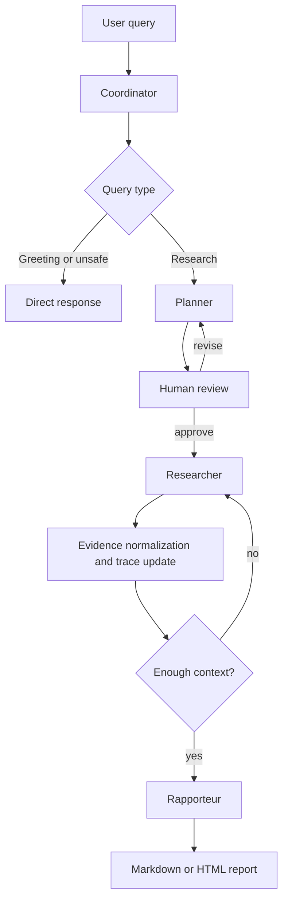

# Architecture

SDYJ Multi Agents is organized as a stateful research workflow. The design goal
is to keep the agent behavior controllable: each role owns a narrow
responsibility, every step updates a shared state, and the user can approve the
plan before tools are executed.

## Workflow



## Agents

| Agent | Responsibility | Main files |
| --- | --- | --- |
| Coordinator | Classify input, initialize state, route simple requests | `SDYJ_Agents/agents/coordinator.py` |
| Planner | Generate and revise structured research plans | `SDYJ_Agents/agents/planner.py` |
| Researcher | Execute source-specific retrieval tasks | `SDYJ_Agents/agents/researcher.py` |
| Rapporteur | Synthesize findings into reports | `SDYJ_Agents/agents/rapporteur.py` |

## Shared State

The workflow passes a dictionary-like state through LangGraph nodes. Important
fields include:

| Field | Meaning |
| --- | --- |
| `query` | Original user request |
| `query_type` | `GREETING`, `INAPPROPRIATE`, or `RESEARCH` |
| `research_plan` | Structured plan generated by Planner |
| `plan_approved` | Human-in-the-loop approval gate |
| `research_results` | Retrieved evidence grouped by tool and query |
| `evidence_items` | Deduplicated `E1/E2/...` evidence with URL, domain, query, date, and score |
| `iteration_count` | Number of executed research tasks |
| `max_iterations` | Runtime budget configured by user |
| `final_report` | Generated Markdown or HTML |
| `report_metrics` | Citation density, duplicate URL ratio, tool success rate, and related report metrics |
| `trace` | JSON-serializable run trace for nodes, LLM calls, tools, errors, and metrics |

## Tool Layer

The Researcher currently supports:

- Tavily for web search.
- arXiv for academic paper search.
- MCP-compatible HTTP adapter for external tools.

The tool interface returns a normalized shape:

```python
{
    "query": "...",
    "source": "tavily",
    "results": [
        {
            "title": "...",
            "url": "...",
            "snippet": "...",
            "relevance_score": 0.92,
            "metadata": {},
        }
    ],
    "timestamp": "...",
}
```

The Researcher also normalizes raw results into evidence items:

```python
{
    "evidence_id": "E1",
    "task_id": 1,
    "query": "agent evaluation trace evidence",
    "source": "tavily",
    "title": "...",
    "url": "https://...",
    "domain": "example.com",
    "snippet": "...",
    "relevance_score": 0.92,
    "published_date": "2026-04-01",
}
```

The Rapporteur uses these IDs in report claims and in the reference section, so
reviewers can trace a claim back to source, query, and tool.

## Observability

Each run can persist a trace under `outputs/traces/<run-id>.json`. The trace
contains:

- workflow node events with latency and metadata;
- LLM calls with latency, prompt/response size, and provider token usage when available;
- retrieval tool calls with source, query, result count, latency, and error;
- report metrics such as evidence count, citation count, duplicate URL ratio, and grounded key-finding rate.

Use:

```bash
python main.py inspect-run
python main.py inspect-run <run-id>
```

## Evaluation

`SDYJ_Agents/evaluation/` contains hard scenarios, metrics, and a runner. The
default evaluation mode uses canned evidence for reproducibility; `--live`
switches the Planner/Rapporteur/Coordinator to a real provider such as DeepSeek.

```bash
python main.py eval --max-scenarios 1
python main.py eval --live --provider deepseek --model deepseek-v4-flash --scenario agent_reliability_hard
```

## Extension Points

- Add a new model provider by implementing `BaseLLM` and registering it in
  `LLMFactory`.
- Add a new retrieval source by exposing a `search(query)` method and wiring it
  into `Researcher._search`.
- Add a new output format by extending `Rapporteur.generate_report`.
- Add richer evaluation by extending `evaluation/scenarios.py` and
  `evaluation/metrics.py`.
